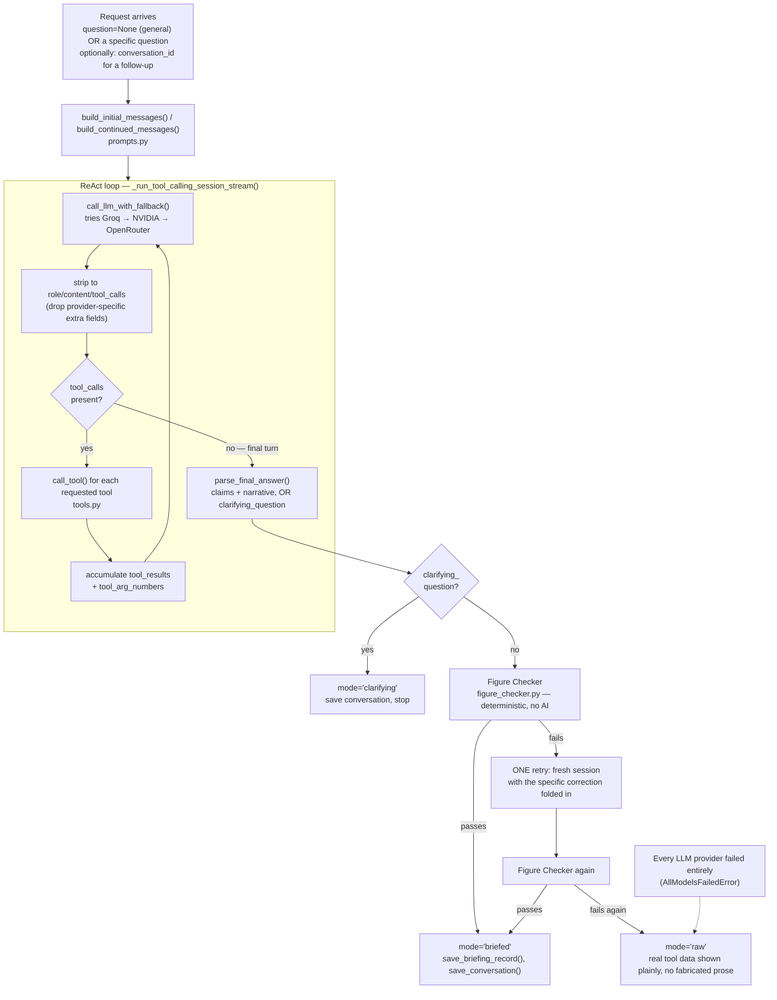

# Tingog — Briefing Agent Design

*Companion to [ARCHITECTURE.md](ARCHITECTURE.md) §9–12, which places the agent in the whole system. This document goes one level deeper: the actual mechanics of the one AI component in Tingog — how it decides what to look up, how its output gets verified before anyone sees it, and how it stays usable despite real, live multi-provider LLM unpredictability.*

## 1. What this agent is, precisely

A **bounded, multi-turn, tool-calling (ReAct-style) session** — not a chatbot with knowledge of the world, and not a fixed report template filled in with numbers.

Given a request (a specific question, or "write the general briefing"), the model:
1. decides which of 7 available tools it actually needs,
2. calls them itself, one or several at a time,
3. reads the real results,
4. either calls more tools, asks a clarifying question, or produces a final `claims` + `narrative` answer.

It is never handed a pre-fetched bundle of "everything" to summarize — it reasons about what the specific request actually requires. And critically: **every claim in its final answer is mechanically checked against the real tool data it gathered, before a coordinator ever sees it** (§5). This is the one piece of the whole Tingog pipeline that touches an LLM at all — everything else (severity scoring, escalation detection, clustering) is deterministic arithmetic, by design (ARCHITECTURE.md §7–8).

## 2. End-to-end flow

Two structurally separate consumers of this same loop:
- **`run_briefing()`** — blocking, returns one `BriefingResponse`. Used by the scheduled loop and the original `GET /api/briefing` endpoint.
- **`run_briefing_stream()`** — the same try → check → retry-once → raw-fallback *policy*, re-implemented directly on the streaming primitive so it can `yield` a step event after every tool call, tool result, check, and retry (§6). Deliberately **not** sharing `run_briefing()`'s control-flow code, only the underlying tool-calling generator — a bug in this newer, higher-risk streaming path is structurally unable to reach the blocking endpoint, which stays available as a fallback if streaming itself misbehaves.

## 3. The tools

All in `backend/app/agent/tools.py`. No tool ever mutates anything — structurally, not just by prompt instruction (a hard constraint of the project: the agent cannot rank or dispatch aid, and cannot log a delivery — only a coordinator can, via a separate non-agent endpoint).

| Tool | Returns | Notes |
|---|---|---|
| `get_unaccounted_puroks` | list — puroks silent beyond the threshold, with hours since contact and why | "Used to hear from them, now don't" — puroks that never made contact at all surface via `/api/puroks` (`status=unknown`) instead |
| `get_active_clusters` | list — puroks reporting the same (or mixed) need close together in time | Same deterministic clustering logic the dashboard map uses |
| `get_high_severity` | list — puroks currently scored `high`, with reasons | Mirrors the deterministic inference engine's own output |
| `get_anomalies` | list — puroks with unusually frequent presses | Crude placeholder rule, disclosed as such in its own description |
| `get_recent_activity` | dict — event counts over the trailing N minutes | `minutes` is coerced to `float()` before use — a real fix, see §7 |
| `get_purok` | **dict keyed by purok_id** (e.g. `{"4": {...}}`), not a flat record | The one tool shaped differently from the rest — the system prompt explicitly calls this out with an example, since models otherwise write ambiguous bare field names |
| `get_previous_briefing` | dict — the last successfully delivered narrative, if any | Lets the agent say "compared to last time" instead of re-describing the full current state from scratch every call |

`call_tool()` is wrapped in a broad `try/except` that turns any failure — an unknown tool name, or a malformed argument shape a specific tool didn't happen to guard against — into a model-visible `{"error": ...}` result instead of crashing the whole session. This mirrors how an unknown tool name was already handled; a real crash from a malformed *argument* (§7) is what motivated generalizing it.

## 4. The contract with the model — `prompts.py`

The system prompt (`BASE_PROMPT`) states the rules plainly, then requires the final answer as JSON with exactly two keys:

- **`claims`** — a list of objects, each citing `source_tool` and `source_field` (a path into that tool's result — e.g. `"[0].hours_since_contact"`, `"total_events"`), plus whatever other fields describe the fact.
- **`narrative`** — a short paragraph built *only* from those claims; every number in it must also appear in a claim.

Rules stated directly in the prompt, later enforced mechanically (§5) rather than trusted on faith:
- Never invent a number or named purok that didn't come from a real tool result.
- Never rank puroks by who should get aid first — describe patterns and severity, but the decision is the coordinator's.
- Silence is never described as "safe" — always "unknown"/"unaccounted for."
- Plain language, not jargon ("several puroks reporting the same thing at once," not "cluster").

If a real coordinator is present to answer (i.e. `question` is not `None`), an addendum allows the model to instead respond with `{"clarifying_question": "..."}` when a question is genuinely ambiguous — used rarely, and never offered for the unattended general/scheduled briefing, since nobody would be there to answer it.

## 5. The Figure Checker — why the AI's output can be trusted anyway

`backend/app/agent/figure_checker.py`, `check(llm_output, tool_results, tool_arg_numbers)`. **Deterministic, plain Python — never a second LLM call.** This is a stronger guarantee than the common "have the model critique itself" pattern, which can still hallucinate agreement; arithmetic can't.

Two passes, run in order:

**Pass 1 — every claim must resolve to something real.** For each claim, `resolve_path()` walks `source_field` into the actual tool result (`get_purok`'s dict-by-id shape and ordinary lists both supported, including bracket syntax for a dict key like `"[4].status"`). The resolved value must match the claim.

Several real leniencies were added after live testing surfaced false positives — each is a deliberate, narrow accommodation, not a general loosening:

| Leniency | Why it exists |
|---|---|
| Singleton-list index omission (`"silence_score"` instead of `"[0].silence_score"`) | Models consistently write this for a one-element list — a plausible formatting choice, not a random slip |
| Whole-list citation containing the true value | A claim citing a purok's full `reasons` list when it meant one string within it is imprecise about *which* index, not wrong about the *fact* |
| Sibling-field naming mismatch (`"purok": "Purok 4"` when the real record's key is `purok_name`) | The claimed **value** was exactly right — only the model's own label for it differed from the backend's internal field name |
| Mild string paraphrase (`"high severity"` for the real value `"high"`) | The claimed string must fully *contain* a real value from the record — a genuinely wrong value still contains no real value and is still rejected |
| Tool-call argument numbers (`window_minutes: 30`) | A number the model itself chose as a *query parameter* can never appear in any tool *result* — it's an input, not returned data — but it's still a real, legitimate number, tracked separately as `tool_arg_numbers` |

Every leniency above has a matching **negative** regression test in `backend/tests/test_figure_checker.py` confirming a genuinely wrong value, under any of these disguises, still fails the check.

**Pass 2 — every number in the narrative must trace back to a claim (or a known tool argument).** `_flatten_numbers()` extracts every number from every claim's own fields; every number appearing in the narrative text must be among them, or among `tool_arg_numbers`.

**On failure:** `build_retry_messages()` starts a *fresh* bounded session (not a continuation of the failed one) with the specific correction folded in — e.g. "You claimed X, the actual value is Y, call the tools again and verify." One retry only. If the retry also fails the check, the coordinator sees the real gathered tool data plainly instead of unverified prose — never a fabricated-sounding failure, never a blank screen.

## 6. Real-time streaming — watching the agent think

`GET /api/briefing/stream` (`backend/app/routers/briefing_stream.py`) turns the whole try → check → retry → raw policy into a live Server-Sent-Events feed instead of one blocking response, so a coordinator watching the dashboard sees the actual process — not just a spinner, then an answer.

| Event `type` | Fields | When |
|---|---|---|
| `tool_call` | `tool`, `args` | The model requests a tool |
| `tool_result` | `tool`, `result` | The tool executed |
| `checking` | — | Figure Checker about to run |
| `check_failed` | `reason` | First attempt failed validation — about to retry, shown live rather than hidden |
| `retrying` | — | Second pass starting |
| `clarifying` | `clarifying_question`, `conversation_id` | Terminal |
| `final` | `mode`, `claims`, `narrative`, `tool_results`, `trigger_source`, `conversation_id` | Terminal |
| `error` | `message` | Terminal-adjacent — always followed by a `final` (`mode="raw"`), never left dangling |

The DB session is opened and managed *inside* the generator itself, not via FastAPI's `Depends()` — that closes a resource the instant the route function *returns*, which for a `StreamingResponse` is immediately after construction, not when the stream finishes. `AISitRep.tsx` consumes this with a plain `EventSource` (GET + query params, free auto-reconnect semantics) and renders each step as a real chat-timeline entry, not a raw JSON dump — past turns stay visible and collapsible rather than being replaced by the next answer.

## 7. Multi-provider reliability — real bugs found and fixed live (2026-08-17)

`backend/app/agent/llm_client.py` tries providers in a flat, ordered list — Groq, then NVIDIA, then OpenRouter's free tier — a fresh `httpx.AsyncClient` per attempt, each under a hard wall-clock `asyncio.wait_for` deadline (httpx's own timeout isn't reliable if a provider trickles keep-alive bytes without finishing). Groq and NVIDIA are preferred over OpenRouter specifically because they give a *dedicated per-account* free quota rather than a pool shared with every other user of that model — confirmed live, not assumed, after watching OpenRouter's `:free` tier 429 with `"limit_source":"upstream_provider_shared_pool"`.

Three real, previously-undiscovered bugs were found by testing the live pipeline repeatedly and reading actual provider error bodies (never assumed to be "just AI variability" without checking) — each is now a permanent fix plus, where practical, a regression test:

**1. A malformed tool argument could crash the entire stream.** A model call arrived with `minutes="30"` — a JSON string, not a number — and `timedelta(minutes=str)` raised an unguarded `TypeError`, killing the whole SSE request instead of degrading gracefully. Fixed at the specific call site (`float(minutes)` coercion) *and* with a general `try/except` safety net in `call_tool()`, so any future argument-shape mismatch degrades to a model-visible `{"error": ...}` instead of taking down the request.

**2. A reasoning-capable provider's extra fields silently poisoned later calls to a different, stricter provider.** NVIDIA's nemotron model returns `reasoning`/`reasoning_content` fields alongside the standard `role`/`content`/`tool_calls` shape. Because the fallback chain restarts from the *top* on every loop iteration (not just the provider that succeeded last), that raw message — appended verbatim into shared conversation history — got sent to Groq on the next iteration, which rejects unknown fields outright: `400 "'messages.N': property 'reasoning_content' is unsupported"`. One reasoning-model turn was silently turning into a whole-session failure. Fixed by stripping every assistant message down to `{role, content, tool_calls}` at the single point it re-enters shared history, before any provider-specific extra field can propagate — confirmed both by a passing/failing regression test (`test_briefing_agent.py`) and by directly querying NVIDIA's real API and observing both extra fields in a live response.

**3. A configured NVIDIA model slug was simply wrong.** `nvidia/nemotron-nano-9b-v2` 404'd on *every single attempt*, silently wasting a full timeout window on every LLM call whenever it was reached. Found by reading the live warning log rather than assuming a name recorded weeks earlier was still correct; confirmed and corrected by querying NVIDIA's actual `GET /v1/models` catalog directly with the real API key — the working slug is `nvidia/nvidia-nemotron-nano-9b-v2` (the `nvidia-` prefix repeats). The corrected model was then confirmed, via a direct API call, to genuinely support multi-tool-call turns — unlike `meta/llama-3.1-8b-instruct`, which has a separate, confirmed structural limitation (`"This model only supports single tool-calls at once!"`) and is kept only as a last resort, ordered *after* the model that actually handles this agent's normal multi-tool turns.

If every provider fails outright (`AllModelsFailedError`), the coordinator still sees the real underlying tool data via the same `raw` mode the Figure Checker's own repeated-failure path produces — one honest fallback surface, not two different ones to reason about.

## 8. Live reliability check — verification visible in the app itself, not just reported

`GET /api/diagnostics/briefing-reliability` (`backend/app/routers/diagnostics.py`) runs the **exact same real pipeline** (`run_briefing_stream`, the same code the live "Ask" button calls) N times in a row and streams each real pass/fail result — mode, latency, retry count, error — as it happens. A floating button on the dashboard (heart-pulse icon) opens `ReliabilityPanel.tsx`, which renders these results live in the browser.

Two deliberate design choices:
- **Sequential, not parallel** — this must reflect the same one-coordinator-at-a-time latency the live demo will actually experience, not an artificially fast concurrent burst.
- **`persist=False`** — test runs never call `save_briefing_record`/`save_conversation`, so repeated reliability checks can't flood the dashboard's real "last briefing" state or the conversation history the live agent's own memory tool (`get_previous_briefing`) reads from.

This exists because a verbal "I ran it a few times and it mostly worked" report isn't something a stakeholder should have to take on faith when the underlying dependency (free-tier LLM providers) is genuinely, verifiably unpredictable — the same instrumentation used to find and confirm every bug in §7 is left running, reachable at any time, in the shipped app.

## 9. Where this agent's honesty actually comes from

Not from asking the model to be careful — from structure that doesn't depend on it complying:
- It cannot rank puroks or dispatch aid — no code path exists for either, independent of what any prompt says.
- Its most consequential trigger (event-triggered escalation, ARCHITECTURE.md §10) never touches it at all — that path is pure deterministic arithmetic precisely so a critical alert never depends on an LLM call succeeding.
- Every claim is checked against real data before delivery, by code, not by the model checking itself.
- When verification fails twice, or every provider fails outright, the coordinator still sees something real — the underlying data, not a fabricated-sounding narrative and not a blank screen.
