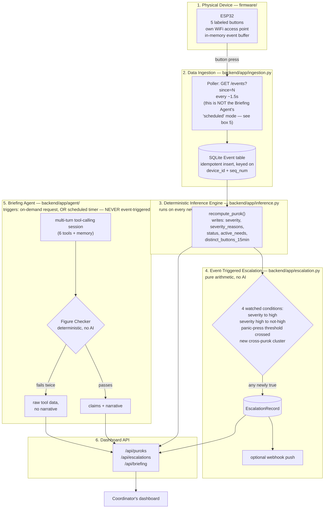

# Tingog — Solution Architecture

*Reference for explaining the system to someone technical who isn't reading the code — a mentor, a judge, a new teammate.*

## 1. The problem — and where Tingog draws its scope line

**Root cause, stated precisely:** barangay-level mapping and assessment has to complete and manually escalate up the chain before higher-level decision-makers see accurate statistics. By the time it arrives, the true situation has already changed — so urgent things become too late to act on. This isn't "coordinators lack information" in the abstract; it's a specific latency problem in how ground truth travels upward.

This same root cause shows up in more than one place once you look for it — real fieldwork for this project surfaced two examples:
- Household damage gets surveyed by a BHW, listed, then separately *verified* before anything moves.
- Relief goods aren't delivered immediately even once a need is confirmed, because roads and bridges still have to be checked as passable first.

**Tingog's scope is deliberately bounded to one slice of this:** collapsing the *information* latency — getting a real, current signal from a community directly to a decision-maker, bypassing the manual survey-and-escalate chain. It does **not** claim to solve relief logistics capacity (trucks, supply, an actually-impassable bridge) — those are real constraints independent of how fast information travels, and conflating them would overclaim what this system does.

## 2. System at a glance

**Walking through it, box by box:**

1. **Physical device** — the ESP32 creates its own WiFi network; a press sits in its memory until asked for.
2. **Data ingestion** — the backend asks the device "anything new?" roughly twice a second and stores whatever comes back, safe against being asked twice for the same thing. This interval has nothing to do with box 5's "scheduled" mode — different mechanism, different purpose, explained in §6.
3. **Inference engine** — plain arithmetic, not AI, turns raw presses into a severity score, a status, and which needs are currently open. Runs on every event *and* on a timer, so a purok going quiet for too long is caught even with no new press.
4. **Escalation** — watches the inference engine's output for four specific transitions and fires an alert the instant one happens, still no AI involved.
5. **Briefing Agent** — the only AI in the system, and only ever started by a person asking or a timer firing — never by an individual button press or escalation directly. Everything it says is checked against real data before box 6 ever sees it.
6. **Dashboard API** — where all of the above actually becomes visible to a coordinator.

## 3. Two tracks — fielded vision vs. what's actually built this week

| Layer | Fielded vision | This week's build |
|---|---|---|
| Radio | LoRa, kilometres of range, purok device + gateway | ESP32 WiFi (AP mode), tens of metres — proves the *pipeline*, not rural range |
| Device liveness | Periodic automatic heartbeat, independent of button presses | Cut — covers the *demo table* (laptop polling proves the device is alive), not community status in the field — see §4 |
| Device stewardship | A named accountable party per device (purok leader), tied to existing barangay governance | `purok_leader` field populated with a clearly-generic placeholder ("Purok Leader (TBD)") per purok — reasonable hackathon-grade mock data, not a fabricated real identity, pending real roster data |
| Granularity | One real device per purok (a barangay with 15–20 puroks needs 15–20 devices) — chosen deliberately over per-household, which was the original idea, purely on cost: a 20–50x hardware multiplier at real municipal scale (see §5.1) | One real device; several simulated puroks to demonstrate patterns a single device can't produce alone |
| Button labels | Localized per deployment region — see §4.1 | Bisaya (Cebuano), matching the San Remigio grounding case specifically |

## 4. The button device

**Five buttons: TABANG (help), TUBIG (water), TAMBAL (medicine), PAGKAON (food), and a fifth "nothing urgent" button.**

- **TABANG, TUBIG, TAMBAL kept separate** — Sphere Standards (the international humanitarian framework) treats water and medical/health as distinct core sectors: different urgency timelines, different response types.
- **PAGKAON kept separate from TUBIG** despite both being "sustenance" — food logistics are naturally multi-day regardless of urgency, so the earlier that process starts, the earlier it finishes. Merging the two would cost the clustering signal that makes the system useful (which specific need is spiking, where).
- **The fifth button is coded LUWAS internally, but displayed as "OK."** LUWAS was originally assumed to translate to "safe"/"all-clear" — it doesn't; its actual root sense is closer to "to go out / to escape." Caught during translation review, after which "OK" was chosen as an unambiguous replacement (over more "authentically Bisaya" alternatives) precisely because it can't be mistranslated. The wire protocol, backend `Event.button` values, and internal code all still use `LUWAS` — that's the real hardware's wire code, and changing it would mean touching firmware outside this repo for no functional benefit. Only the dashboard-facing label changed. This is a deliberately disclosed internal-name-vs-display-name split, not an inconsistency.
- **This button is the one worth real scrutiny regardless of name.** It only works if someone actively presses it, and people reliably report problems, not confirm they're still fine. The fielded automatic heartbeat (§3) is what's supposed to cover this; this week's build doesn't have it. A genuinely fine community that doesn't press it looks identical to an unreachable one right now — an honest, named limitation of demo-week scope.
- **Who can press it:** deliberately anyone in the community — like a fire alarm, restricting who's "allowed" to signal distress defeats the purpose.
- **Who's accountable for it:** a separate question from who can press it — see §3's stewardship row.
- **A real, named limitation of the shared-device model:** anyone physically unable to reach the device — trapped, injured, too far within a large purok, the device destroyed or inaccessible — cannot signal at all, and nobody is automatically notified on their behalf. This is a direct consequence of the cost-driven granularity choice in §5.1, not something this week's build works around.

### 4.1 Language — Bisaya labels are a deliberate pilot choice, not an inclusivity oversight, but the fielded design needs to say so explicitly

The current labels are Cebuano/Bisaya specifically because the grounding case (San Remigio, Cebu) is a Bisaya-speaking area — a community member there recognizes TABANG or TUBIG instantly. That same choice would fail in a Tagalog-, Ilocano-, or Waray-speaking region, where the labels would be meaningless. Worth naming directly rather than leaving unaddressed:

- **The software doesn't need to change for this at all.** `TABANG`/`TUBIG`/etc. are internal identifiers in the data model and API — nobody in the field ever reads them. What's physically printed on a button is a manufacturing decision, decoupled from the backend entirely.
- **The real fielded fix is icons, not just translated text** — a water droplet, a medical cross, a plate of food, a raised-hand/distress icon, a checkmark — universally recognizable regardless of language, and critically, regardless of literacy too, which text-only labels in *any* single language don't solve.
- **Local-language text stays valuable as a second, redundant channel alongside the icon** (standard practice for real safety signage), localized per deployment region at manufacturing time — Bisaya for this pilot, Tagalog/Ilocano/Waray/etc. elsewhere, same hardware and software underneath.

## 5. What one press actually means

**A press does not correlate to an individual.** The device is per-purok, not per-household or per-person — one shared unit at a community gathering point, anyone can press it. A single TUBIG press means "this purok has this need," not "this many people need it."

**More presses of the same button from the same purok do not mean more people are affected — by design, verified in the actual scoring code.** No rule weights repeat presses of one button. The only multi-press rule (panic-press) specifically requires *different* buttons in quick succession — a distress-under-stress signal, not a headcount proxy. `baseline_household_count` (a pre-known figure from barangay roster data, displayed as "No. of Households") answers a different question — how many households live there at all, not current scale of *this* reported need — and isn't even exposed to the Briefing Agent's tools, so it structurally cannot be cited as if it answered a question it doesn't. Renamed from `baseline_vulnerable_count` on 2026-08-17: nothing anywhere ever computed a real vulnerability assessment, so the old name and its seeded 0-3 range implied both a methodology and a household count that don't exist — the field is real (a genuine placeholder pending real roster data), but "vulnerable" was a claim this project couldn't back.

### 5.1 Why not just add more devices, or ask for a headcount — the cost problem

Per-household devices were the original idea, dropped specifically for cost: at ~20–50 households per purok, per-household deployment is a 20–50x hardware multiplier over per-purok, the difference between a deployable budget and an impossible one at real municipal scale. This is a defended tradeoff, not an oversight.

Options considered for recovering some sense of scale without paying that cost:

| Option | Verdict | Why |
|---|---|---|
| Count repeat presses as a proxy for more people | Rejected | Can't distinguish one anxious person pressing 3 times from 3 different households each pressing once — no identity mechanism exists |
| Add a quantity input to the device (dial, bucketed count) | Considered, not recommended without testing | Directly fights the core UX principle — recognition under stress, not decision-making. Would need real testing under stress conditions before trusting it |
| A field-confirmation step — first human on-site logs a real headcount | **Rejected, and instructive why:** it re-creates the exact slow manual-verify process this system exists to bypass (§1). Solving stale information with another round of "wait for someone to go look" fails the project's own root-cause test |
| Passive motion/approach sensor on the existing device (~$1–2, e.g. PIR) | Promising, not yet built | Doesn't change user behavior at all — separately counts distinct *approaches* to the device, independent of button presses. Weak, probabilistic corroborating evidence (3 presses + 3 approaches reads differently than 3 presses + 1 approach), not a precise count — would need honest "not confirmed" framing in any narrative that uses it |
| Risk/population-weighted deployment density (2+ devices for larger/higher-risk puroks) | Legitimate, deployment-strategy answer | Doesn't solve within-purok granularity, but matches resolution to where it actually matters instead of a uniform rule everywhere |

**Where this honestly lands:** Tingog does not claim to know affected headcount, deliberately — same category of scope boundary as §1's information-vs-logistics line. The one cheap, buildable step worth taking: make the Briefing Agent state this explicitly ("reported, headcount not confirmed") rather than silently omitting it, turning an open gap into a stated limitation.

## 5.2 Delivery records — closing the loop without becoming a logistics system

LUWAS is a purok's own self-report, and it's all-or-nothing: pressing it means "we're fine now" and clears *every* open need at once, even if only one of several was actually addressed. A coordinator can instead log a **delivery** — confirming a specific item (`TUBIG`, `TAMBAL`, etc.) was actually brought to a specific purok. `active_needs` is computed by merging button-press events and delivery records into one chronological timeline: a delivery clears only the item(s) it names, and a need pressed again *after* a delivery correctly stays active rather than being silently absorbed by an earlier one.

This is deliberately not a step toward a full distribution-management system — that idea (inventory tracking, delivery routing, supply allocation) was seriously considered and explicitly archived, same category as the Access/Verification specialists and the field-confirmation endpoint (§1). Two reasons: it's a genuinely different, much larger software problem than anything else in Tingog, not a table-and-endpoint addition — and more importantly, building it would reverse the scope boundary already staked out in §1. What got built instead is deliberately small: a confirmation log, not a planning system. No stock/inventory count, no routing or dispatch, no cross-purok allocation.

Write path: `POST /api/puroks/{id}/deliveries` — human-triggered only. Never exposed to the Briefing Agent as a callable tool; the agent can read delivery history (via `get_purok`) to cite it in a narrative, but can never create a record itself.

## 6. Getting the signal to the backend — and why this "polling" is not the same thing as "scheduled" mode

**A recorded timestamp on an event and the backend *knowing about* that event are two different things.** The ESP32 buffers presses in its own memory on its own tiny WiFi network — nothing connects it to the backend's database until something actively asks it "what's happened?" and transfers the answer over. Polling is that retrieval step, not a second time-recording mechanism layered on top of the first.

- The backend **polls** the device (~1.5s interval) rather than trusting it to push — a small, low-power board is more reliable when it only has to answer a question than when it has to manage its own outbound connection and retry logic. This interval is realistic for ongoing real operation, not just a demo convenience — it's a lightweight local check between a laptop and a nearby device, not something that meaningfully taxes either side.
- Every message carries a sequence number — a repeated question (e.g. after a network retry) never gets double-counted.
- **This is a completely different mechanism from the Briefing Agent's "scheduled" trigger mode (§10)**, which runs every few hours and generates an AI narrative. One moves raw button-press data; the other periodically asks the AI to summarize. Easy to conflate since both are "a timer checking for something" — worth keeping distinct when explaining the system.

## 7. Inference engine — deliberately deterministic, not AI

**Why a 60-second sweep exists at all, given events already carry a timestamp:** severity partly depends on how much time has passed since the last event, measured against *right now* — a moving target. If recomputation only ever ran when a new event arrived, a purok that goes completely silent would never be recomputed again, because there'd be no new event to trigger it — the system would keep showing whatever severity it had hours ago, frozen, exactly while the real situation is getting worse. A purely event-driven design can never react to the *absence* of an event. The sweep is what checks the clock independently, specifically to catch "nothing has happened, and that itself is the problem" — which is the whole premise this system is built around (§8, rule 1).

Runs on **every new event**, and independently on a **60-second sweep** across all puroks (so a purok going silent long enough is caught even with no new press). Turns raw presses into:

| Attribute | What it is |
|---|---|
| `severity` | `low` / `medium` / `high`, from a weighted rule table (silence >6h, silence >12h, neighboring puroks also silent, last press was a held TABANG, panic-press) |
| `severity_reasons` | Which specific rules fired — the stated "why" behind the score |
| `status` | `unknown` / `attention` / `stable` — derived from severity, recency, and whether the last press was LUWAS |
| `distinct_buttons_15min` | Count of different button types pressed in the trailing 15 minutes — feeds the panic-press rule |
| `active_needs` | Which need-buttons are currently "open" — cleared by a LUWAS press, or by a coordinator logging a matching delivery (§5.2) |

**Severity is not merely time-based** — two of the five rules have nothing to do with elapsed time at all:

| Rule | Category | What it's actually about |
|---|---|---|
| No contact in over 6h | Time | how long since last contact |
| No contact in over 12h | Time | stacks with the above for longer silence |
| Neighboring puroks also silent | Time, but comparative | not this purok's own time — whether most *other* puroks nearby are also quiet |
| Last press was a **held** TABANG | Content/gesture | a long-press of the distress button is itself the signal, regardless of timing |
| 3+ *distinct* buttons within 15 minutes | Pattern | which and how many different button types were pressed, not how much time passed |

A purok contacted 5 minutes ago via a held TABANG press already scores 40 (medium) from that one content-based rule alone — zero time-based rules involved.

Clusters (multiple *different* communities reporting the same need close together in time) are computed the same deterministic way, on demand.

**Why not AI, precisely:** a fixed rule table gives the same inputs the same score and the same stated reasons, every time — no run-to-run variance, and every score traces to exactly which rule fired. An AI model asked to "judge severity" could reasonably score an identical situation differently on two different runs, and even when it's consistent, its explanation is generated *after the fact* — there's no guarantee the stated reason is the actual mechanism that produced the number. For a system whose output might shape where limited response attention goes, that gap between "explanation" and "mechanism" isn't acceptable.

## 8. The honesty rules — enforced structurally, not left to a presenter's memory

1. **Silence is never "safe."** Gone-quiet is marked `unknown`, not `stable`.
2. **Simulated data is real and traceable, end-to-end.** `is_simulated: true` is set on every simulated purok's record and preserved through the full pipeline (DB, API, every response) — auditable and query-able at any point. As of 2026-08-17 this is disclosed **verbally during presentation** rather than as a persistent UI badge/marker-shape distinction, the same pattern already used for `REAL_DEVICE_LAT`/`REAL_DEVICE_LNG` (§4's config comment: "disclosed verbally when presenting... not via a UI badge, since it's real data just imprecisely located") — extended here to a second field, not a new kind of exception.
3. **No ranking of who gets help first.** Structurally excluded — no code path can produce one, not just a prompt instruction.
4. **Every number a summary states must trace to real data.** Mechanically enforced — see §11.

## 9. The Briefing Agent

A real, bounded, multi-turn tool-calling session: the model decides which of the available tools it needs — unaccounted-for puroks, active clusters, high-severity puroks, anomalies, recent activity, one purok's full detail, or the previous briefing's content — calls them itself, reads results, and either calls more, asks a clarifying question, or produces a final answer. It's never handed a fixed bundle of data to summarize; it reasons about what it actually needs for the specific request.

- **Functions like a scoped, fact-checked chatbot** when given a specific question — natural language in, the agent decides what to look up, natural language out, every claim checked before delivery. Two things make it not a generic chatbot: it can only use this system's own tools (no open-ended knowledge), and everything it states is mechanically verified first.
- **Multi-turn conversation** — a `conversation_id` returned with every response can be passed back on a follow-up question, so "what about Purok 4 specifically?" has the prior exchange in context instead of starting a fresh, unrelated session.
- **Clarifying questions** — if a specific question is genuinely ambiguous, the agent can ask back rather than guess an interpretation (never offered for the default general briefing, which may run unattended on a schedule — there's nobody there to answer).
- **Memory** — access to the previous briefing's content means it can reference what's changed rather than always describing the full current state from scratch.

## 10. Four ways this runs — matching how coordination actually works

1. **On-demand** — a coordinator asks, right now (`GET /api/briefing`, optionally with a specific question, optionally continuing a conversation).
2. **Scheduled** — a periodic re-run on a timer (default every 4 hours), independent of anyone asking — **not the same mechanism as §6's device polling**. Distinct job from event-triggered: catches slow-accumulating patterns that never cross a single hard threshold, and serves shift handoffs — an incoming coordinator gets a fresh picture without having to reconstruct it or wait for something dramatic to trigger an update.
3. **Event-triggered** — fires the instant the **deterministic inference engine** (not the AI agent) detects one of four watched conditions newly becoming true, no LLM involved at all:
   - a purok crosses into high severity
   - a purok drops back out of high severity (so a coordinator who acted on the original alert also learns when it resolves)
   - a purok crosses the panic-press threshold *on its own*, even if overall severity doesn't reach "high" — the spec treats rapid multi-button presses as trustworthy regardless of which buttons were hit, so it doesn't wait for enough other factors to combine past the general threshold
   - multiple independent puroks newly form a cluster reporting the same need — arguably the single strongest signal the system produces, pushed the instant it appears rather than waiting for anyone to ask

   Each records an alert and, if a webhook is configured, pushes a notification immediately. This is the mode that most directly serves §1's root cause — it shortens "detection" to "someone told" from "whenever a coordinator happens to check" to instant. The alert message itself is a plain deterministic template, not AI-generated — a critical-path notification can't depend on an AI call succeeding to reach someone.

## 11. The fact-checker — why the AI's output can be trusted anyway

- A second, **separate, deterministic piece of code** (not another AI call) checks every number and every named community the agent wrote against the real tool data it gathered — mechanically, before anything reaches a coordinator.
- Claim doesn't check out → one retry, telling it precisely what was wrong.
- Still wrong → show the real gathered data plainly instead of unverified prose.
- This is a stronger version of the "self-critique" pattern common in AI agent design — most implementations have the model critique itself, which can still hallucinate agreement. This one can't, because the check is arithmetic, not another guess.

## 12. Reliability engineering

- A single AI provider call could hang indefinitely if a provider trickled bytes without finishing a response — fixed with a hard wall-clock timeout, independent of what the HTTP layer's own timeout does or doesn't catch.
- A shared free-tier AI pool became rate-limited for *everyone* using that specific model — confirmed via the provider's own diagnostic response, not guessed. Fixed by preferring providers that give a dedicated quota per account instead of a pool shared with strangers.
- A provider can also reject its own malformed tool-call attempt outright (observed live, not hypothetical) — the fallback chain absorbs this the same way it absorbs any other provider failure, moving to the next option.
- If literally nothing works, the coordinator still sees the real underlying data — never a crash, never a blank screen. Same honesty principle as §8, applied to infrastructure instead of data.

## 13. Governance — who holds this, who can touch it, who's accountable

Raised directly by a mentor review; worth a clear, direct answer rather than a deflection:

- **Physical custody:** fixed installation at a shared community point (chapel, waiting shed) — not any one person's house, deliberately, so it doesn't depend on one specific person being present.
- **Who can press it:** anyone in the community, unrestricted — see §4.
- **Who's accountable for it:** modeled with a `purok_leader` field, populated with a reasonable placeholder for the demo — should map to an existing barangay governance role, not a system-invented permission scheme, once real roster data exists.
- **Dashboard access:** currently unauthenticated, a deliberate hackathon-week cut. In any real deployment this needs role-based access — a dashboard showing exactly which communities are currently high-severity or unreachable is a real operational-security concern if genuinely public, not a missing nice-to-have.

## 14. What's real vs. simulated this week

- One physical device is real.
- A handful of additional communities are simulated, to demonstrate patterns one device alone can't produce — real and traceable end-to-end in the data (`is_simulated: true`), disclosed verbally during presentation rather than a UI badge, per §8.
- The fielded version has one device per real purok; this week proves the pipeline works end to end, not that it's deployed at scale.

## 15. If your mentor asks...

- **"Does more presses mean more people?"** No — see §5. The device is shared per-purok; scale of need is a deliberately unclaimed, out-of-scope question, same reasoning as not claiming to solve relief logistics.
- **"Why are the buttons only in Bisaya — what about other regions?"** Deliberate pilot choice matching the grounding case's language, not an oversight — see §4.1. The fix for a real multi-region rollout is icons plus per-region localized text, a manufacturing decision that doesn't touch the software at all.
- **"Isn't polling every 1.5 seconds wasteful or unrealistic?"** No — see §6. It's a lightweight local check, realistic for real operation, not a demo-only shortcut. It's also a completely different mechanism from the "scheduled" briefing mode — don't conflate the two.
- **"Is the on-demand mode basically a chatbot?"** Functionally yes, with real differences — see §9. Scoped to this system's own tools, and every claim is checked before it's shown.
- **"Does every data change trigger an alert?"** No — exactly four specific, deterministic conditions do, listed in §10. Everything else (e.g. a status change alone, without severity reaching high) doesn't.
- **"What happens if the AI is down or wrong?"** The coordinator still sees everything real — the checker either catches a wrong claim before it's shown, or the system shows the raw data instead of nothing.
- **"Why not let the AI decide who needs help most?"** That's a human judgment with real consequences — structurally excluded, not just discouraged.
- **"Isn't 'unknown' a weaker-looking demo than guessing 'probably fine'?"** The opposite — it's the whole credibility of the system.
- **"Does this solve relief logistics too?"** No, and it doesn't claim to — see §1's scope boundary. It solves the information-latency slice specifically. This boundary was tested twice, not assumed once: Access/Verification specialists and a field-confirmation endpoint were built or proposed then rejected, and a full distribution-management system was separately considered and archived — see §5.2.
- **"Can you tell if relief was actually delivered, not just that a need was reported?"** Yes — see §5.2. A coordinator logs a specific delivery, which clears just that need, not everything at once the way a LUWAS press does. Deliberately stops short of managing distribution itself — a confirmation log, not logistics software.
- **"What's proven vs. aspirational?"** Proven: a button press travels over a self-created wireless network, gets scored deterministically, can trigger an instant alert across four distinct conditions, and can produce a checked, multi-turn AI-written summary on request — live, end to end. Aspirational, stated plainly: rural-scale radio range, the automatic heartbeat that would close the LUWAS gap in §4, real (not placeholder) device stewardship records, icon/multi-language button labels for a wider rollout, and any real signal for scale-of-need (§5.1).
