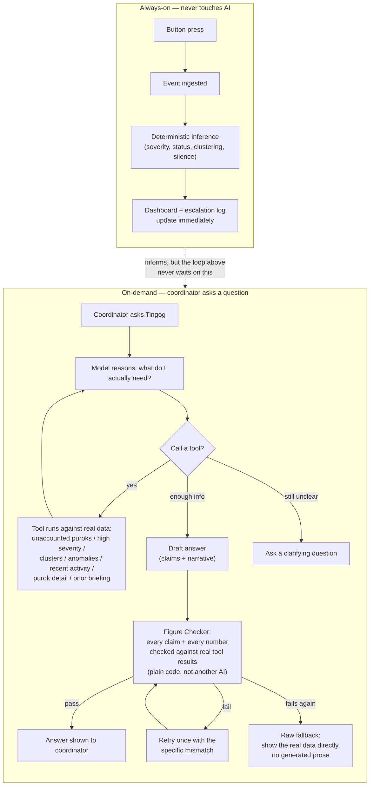

# Tingog Pitch Deck — Slide Outline

Companion to `SCRIPT.md`. **Slides and stages are not 1:1** — one slide can hold multiple stages (e.g. Opening + Problem may share a slide since nothing visual changes between them), and one stage may need more than one slide (e.g. the comparison stage likely wants two). This file tracks that mapping explicitly as it's decided, not assumed upfront.

## Slide list (provisional — count/order will shift as later stages are drafted)

| # | Slide | Covers stage(s) | Status |
|---|---|---|---|
| 1 | Title | 1 | **SPECIFIED** |
| 2 | The Problem | 2 | **SPECIFIED** |
| 3 | Meet Tingog | 3 | **SPECIFIED** |
| 4 | The Four Steps | 4 | **SPECIFIED** |
| 5 | Live Demo (title card only) | 5, 6, 7 | **SPECIFIED** |
| — | *(no separate slide — see Slide 5)* | — | — |
| — | *(no separate slide — see Slide 5)* | — | — |
| 8 | AI Engineering — Agentic Loop Flowchart | 8 | **SPECIFIED** |
| 9 | Why Not an App | 9 | **SPECIFIED** |
| 10 | Scale & Roadmap | 10 | **SPECIFIED** |
| 11 | Closing | 11 | **SPECIFIED** |

---

## Slide 1 — Title

**Covers:** Stage 1 (opening line).

**On screen:** TINGOG wordmark, centered, on the dark theme already built for the dashboard (matches product branding — same identity, not a separate deck style). Team name (L1ghtbyte) and event name (IBPAP Hackathon) small, below the wordmark. No other text, no imagery yet — the spoken line carries the moment, not the slide.

**Why this plain:** the opening belief statement is the hero of this moment, not a visual. Bant.ai's own opening has no complex slide either — the words do the work before anything is shown.

---

## Slide 2 — The Problem

**Covers:** Stage 2.

**Updated for the Stage 2 rewrite:** the old version choreographed three icons landing on three spoken fragments ("power / towers / internet"). The script no longer has three fragments — it's one clause — so that timing no longer applies.

**On screen:** a dark, stylized purok/barangay map — same visual language as the actual dashboard (dark theme, the real map style), not a stock disaster photo. A single faded "signal lost" overlay (crossed-out wifi + cell bars, low-opacity) sits over it for the first two lines. As the presenter reaches "here's the real problem," that overlay fades out and is replaced by a small animated path — a dotted line walking from a purok icon to a barangay hall icon, then up to a higher office icon — visually tracing the survey-and-escalate chain the words are describing, arriving *after* the situation icon has already changed color (e.g. green → red) to make "the situation's already changed" land visually, not just verbally.

**Why this visual:** matches the product's real look from the first real slide, and — more importantly now — the escalation-path animation is doing double duty: it's the same "slow chain" idea this stage argues, shown as a mechanism instead of just told. Reserves the literal dashboard screenshot for the live demo later.

---

## Slide 3 — Meet Tingog

**Covers:** Stage 3.

**On screen:** the actual TINGOG wordmark/icon already built into the dashboard header (`frontend/src/assets/word-dark.png` / `icon-dark.png` — the real product asset, not a separate pitch-only logo treatment), large and centered, appearing the moment "this is Tingog" is said. Small text, "Bisaya for voice," fades in directly beneath it exactly as that line is spoken — on-screen text gives judges a beat to actually register the name meaning, not just hear it once and lose it.

**Why reuse the dashboard asset:** keeps the pitch deck and the actual product visually the same thing, not a separately-designed pitch identity that happens to share a name. Judges seeing this wordmark now will recognize it again the moment the live demo starts.

---

## Slide 4 — The Four Steps

**Covers:** Stage 4.

**On screen:** a horizontal 4-icon pipeline — button icon → radio-wave icon → magnifying-glass/graph icon → dashboard-screen icon — connected by a simple line. Each icon and its word (Report / Transmit / Understand / Respond) fades in as it's spoken, not all at once. The Respond icon previews the real status-dot colors (green/amber/gray) the dashboard actually uses — a small preview of what's coming, not a separate invented color scheme.

**Deliberately not shown here:** the USB cable detail from Transmit, and the three separate outputs now named in Understand (needs/urgency/silence). Both are correctly saved for later — the cable for the live demo's physical reveal, the three Understand outputs for their own dedicated slides (6 and 7). This slide's job is the four-word skeleton judges can hold onto for the rest of the pitch, not the full detail.

**Visual echo:** same left-to-right path grammar as Slide 2's escalation-path animation — that one shows the old, slow manual path; this one shows Tingog's fast path. Not required to be built that way, but worth keeping in mind if the same designer builds both.

---

## Slide 5 — Live Demo (title card only)

**Covers:** Stages 5, 6, *and* 7 — all three are one continuous live-dashboard sequence, not separate visual moments. Stage 7 doesn't add a new press (it can't — silence is time-based, not triggerable), just a shift in attention to a different, already-seeded purok card on the same screen.

**On screen:** minimal — a plain "LIVE DEMO" title card, shown only while the presenter walks to the physical device at the start of Stage 5. Once the first button's pressed, the slide is irrelevant for the rest of Stages 5–7 — attention stays on the physical module, the gateway, and the actual laptop screen (mirrored/projected if possible) through the single-report reveal, the second press that joins the cluster, and finally pointing at Purok 4's silence.

**Real requirement, not a design note:** the dashboard needs to be visibly showing the real device's card before the first press, clearly update after it, clearly show the cluster line appear after the second press, and Purok 4 needs to actually still be sitting at its 14-hour-silent, `unknown` state when this stage happens — which depends on re-seeding at the right time before going on stage, not mid-pitch. Worth a full rehearsal with the physical hardware end to end.

---

## Slide 8 — AI Engineering: the agentic loop

**Covers:** Stage 8. Follows directly from Slide 5's live-dashboard sequence — the "ask Tingog" moment opens on the same screen (the captured response shown/read there), then this slide takes over the instant the script turns to "here's what that actually involved."

**On screen:** a flowchart, split into two clearly separated lanes so the "we don't even touch AI for safety-critical alerts" line has something to point at, not just say. Built from the actual code paths (`briefing_agent.py`, `tools.py`, `escalation.py`/`clustering.py`), not an idealized version:

**Why two lanes, not one diagram:** the script's central claim in this stage is that the safety-critical path (top lane) is architecturally independent of the AI path (bottom lane) — a slow or failed API call can never delay a real alert. Two visually separated lanes make that a property of the picture, not just a line in the narration. The bottom lane's loop-back arrows (tool call → back to reasoning, failed check → retry) are what make "agentic" and "checked against real records" legible at a glance instead of asserted.

**Delivery note:** the presenter doesn't walk the whole diagram line by line — it's a visual anchor behind the spoken script, with maybe two direct callouts: pointing at the `B3` decision diamond when saying "decides for itself which tools to call," and pointing at `B7`/`B9` when saying "checked against real records... not another AI checking itself."

---

## Slide 9 — Why Not an App

**Covers:** Stage 9.

**On screen:** simple two-column comparison, same dark theme. Left column, labeled "An app assumes," lists three short lines that fade in with the spoken clauses: "charged phone" / "cell signal" / "one per person." Right column, labeled "Tingog doesn't need," lists the counters as they're spoken: "shared device" / "direct link" / "no account." No icons needed beyond the wordmark's existing visual language — this slide is about the words being visually paired, not illustrated.

**Why this plain:** the contrast is the entire argument; anything more elaborate (device photos, phone mockups) risks looking like it's mocking a competitor rather than stating a design tradeoff. Matches Slide 1's instinct that some beats are carried by words, not imagery.

---

## Slide 10 — Scale & Roadmap

**Covers:** Stage 10.

**On screen:** a small diagram, left-to-right: several purok-device icons converging on one gateway icon (visualizing "the same gateway can already listen to many devices at once") — reuses the button/radio-wave icon language from Slide 4 rather than inventing new iconography. Below it, a compact "Today → Next" strip: "ESP-NOW (meters–hundreds of meters)" fading in with that line, then an arrow to "LoRa (kilometers)" fading in with "our planned upgrade path." Not a detailed technical diagram like Slide 8 — just enough to make "many devices, one gateway" and "today vs. planned" visually legible at a glance.

**Why this shape:** keeps the scale claim concrete (a real many-to-one architecture already built) clearly separate from the roadmap claim (LoRa, planned but not yet built) — the visual shouldn't blur "what we have" into "what we're planning," matching the script's own care about that distinction.

---

## Slide 11 — Closing

**Covers:** Stage 11.

**On screen:** mirrors Slide 1's minimalism deliberately — the TINGOG wordmark, centered, reappearing on the same dark theme. As the presenter says the tagline, small text fades in beneath the wordmark, word-for-word what's being spoken: *"When a signal dies, your voice doesn't."* Holds through "Thank you," then out to Q&A.

**Why the on-screen line changed:** it used to read *"Because your voice shouldn't be the next thing a disaster takes"* — a different wording from anything spoken, so the final beat landed as two similar-but-not-identical phrasings competing for the same moment. The tagline is now spoken aloud in Stage 11 and shown identically here; a line the audience hears and reads at the same instant is the one that survives the room.

**Why bookend Slide 1:** the script's closing is an explicit callback (Stage 1 → Stage 3 → Stage 11's full-circle "voice" throughline); reusing Slide 1's exact visual treatment makes that callback register visually too, not just in the words — a judge who registered the plain wordmark at the very start sees it return at the very end, unchanged, while everything around it has been proven to work.
